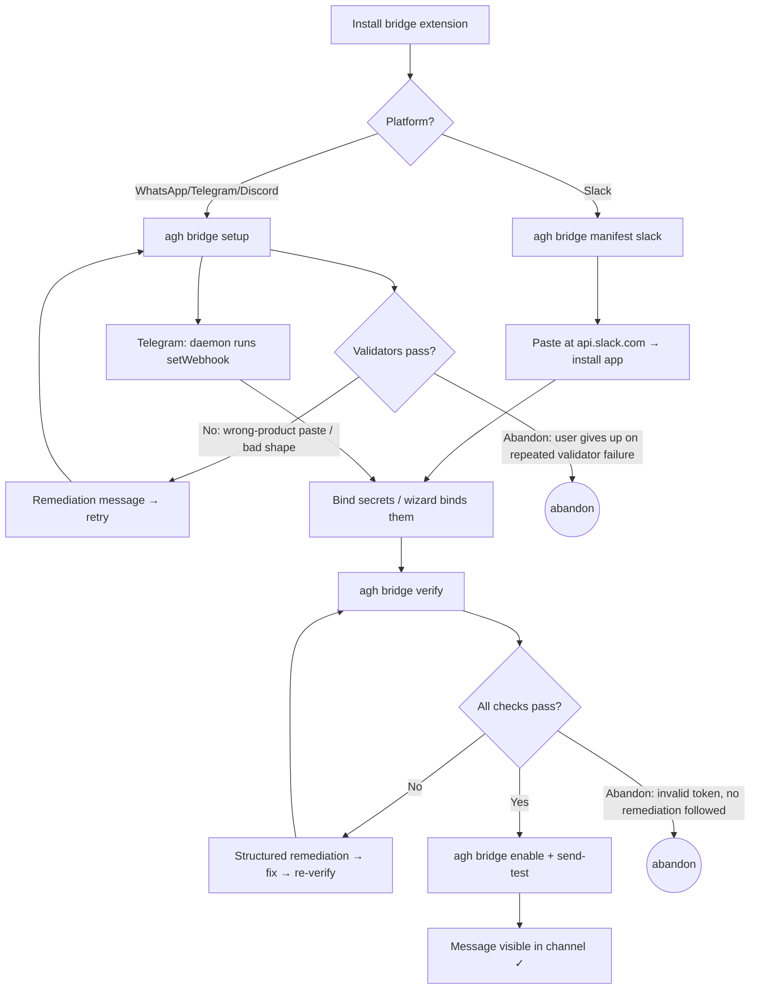
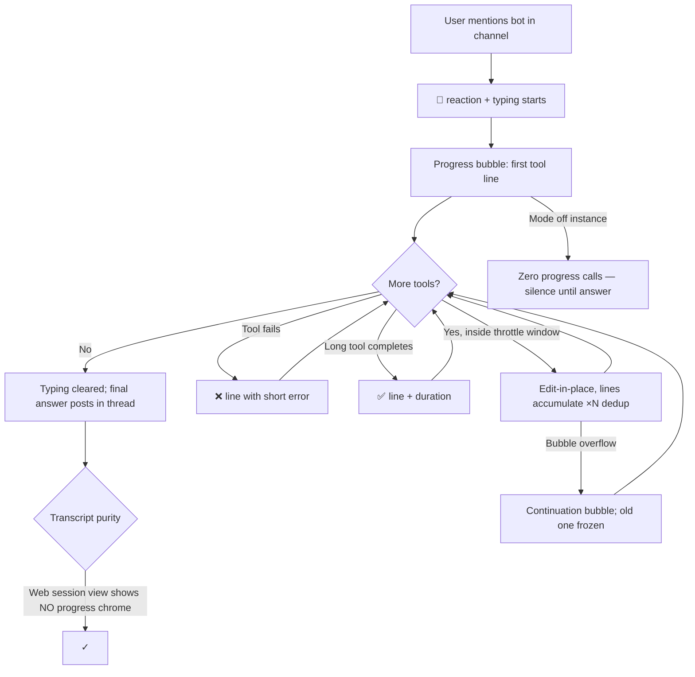
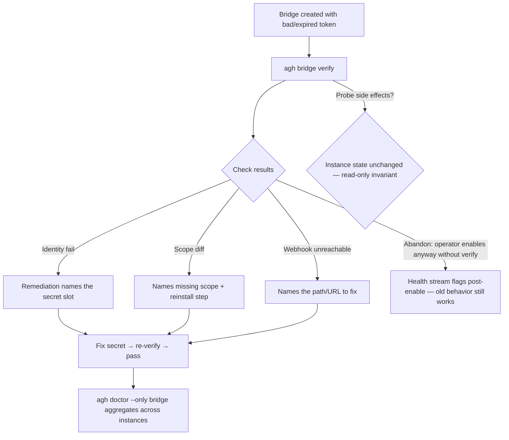
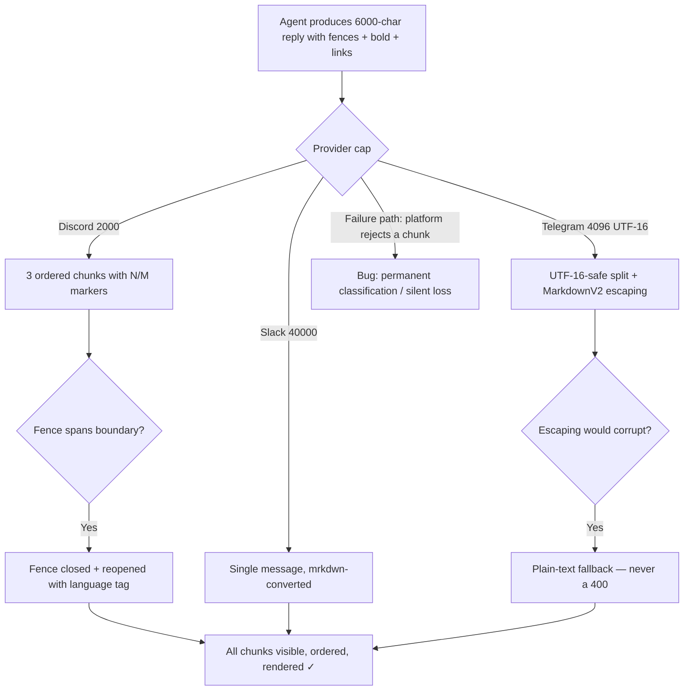
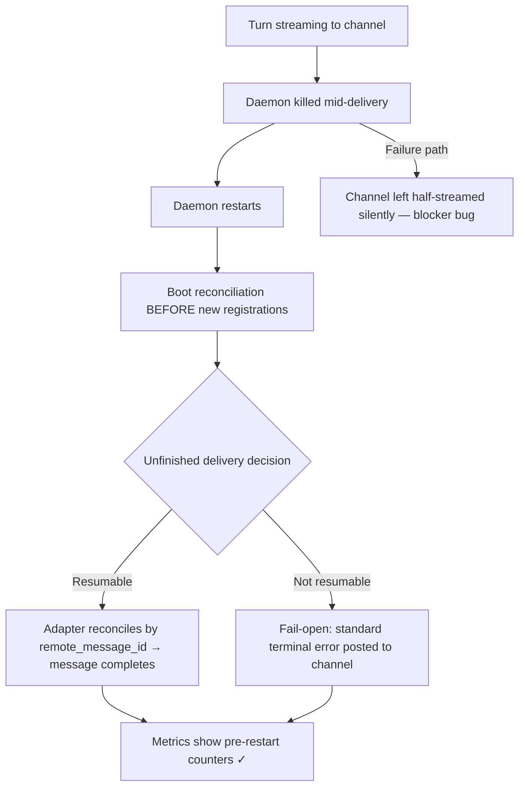
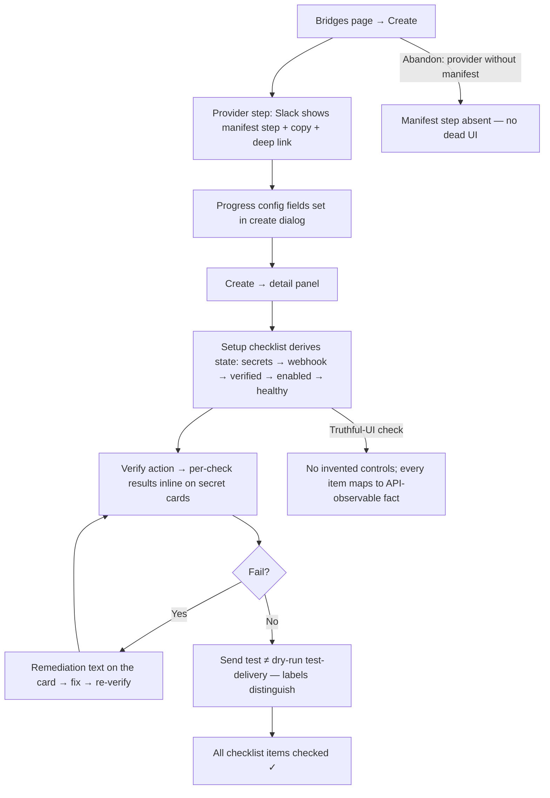
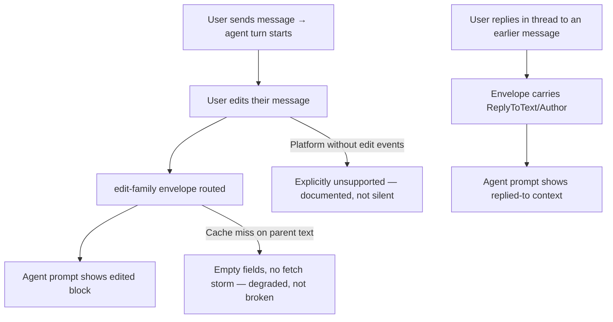

# Bridge Usability Parity (hermes-bridge) — QA Base

> **What this is.** The QA planning base for this program: the input `qa-report` (task_09)
> turns into the living `docs/qa/` tree (journeys, charters, `state.csv` rows) and
> `qa-execution` (task_10) then runs. It pre-derives personas, journey flows, scenario seeds,
> charter seeds, risk taxonomies, and the measurement protocol so the QA pair starts from
> evidence, not from scratch. It does NOT replace the skills: `qa-report` owns the tree
> contract (`docs/qa/{state.csv, journeys/J-NN-*.md, charters/CH-NNN.md, bugs/BUG-NNNN.md,
> reports/, automation-backlog.md}`); this file is upstream source material.
>
> Companions: `_techspec.md` (design + §3.8 invariants), `_tests.md` (the automated backbone —
> journeys below map onto its §6/§7 E2E cases), `analysis/*` (evidence corpus).

## 1. Tracker contract & conventions

- **Area code:** `NB` (Network & bridges — already defined in `docs/qa/README.md`).
- **Id minting:** highest existing row is `NB-046`; new scenario rows start at **`NB-047`**.
  Confirm the actual next free id at planning time — ids are never reused or renumbered.
- **Schema discipline:** rows follow `.agents/skills/qa-report/references/state-schema.md`
  (16 columns; prose only in `notes`; `qa_status` enum only). New rows land `untested`.
- **Flag, don't retest:** planning (task_09) writes rows and resets; verdicts come only from
  executed sessions (task_10).
- **Flows before matrix:** the journeys in §3 become `docs/qa/journeys/J-NN-*.md` files with
  full Mermaid flows BEFORE scenario rows are minted; each row's `journey` column must point
  at a real journey file.
- **Completeness rule:** every journey is walked by an assigned persona; every new/changed
  behavior row maps to a charter.

## 2. Personas (to register/refresh in `docs/qa/personas.md`)

| Persona | Who | Motivation | QA lens |
| --- | --- | --- | --- |
| **First-time operator** | Dev/ops setting up their first channel (Slack or WhatsApp) | Wants an agent in the team channel today, has never seen AGH bridge docs | Time-to-first-message, wizard remediation quality, docs truthfulness |
| **Agent automator** | An AI agent (or script) driving setup headlessly | Must configure bridges via structured CLI/HTTP/UDS only — no TTY, no browser (SD-011) | `--json` wizard lane, webhook-register route, structured verify output, exit codes |
| **Teammate observer** | Non-operator teammate in the channel while the agent works | Wants to see what the bot is doing without spam | Progress modes/threading/typing/reactions, throttling under tool storms, mode `off` silence |
| **Bridge operator (steady-state)** | Operator running 8-provider fleet in production | Cares about delivery robustness and recovery | Chunking, markdown fidelity, restart-mid-turn recovery, durable metrics, web checklist truth |

Security is a **lens applied across charters** (redaction, secret masking, read-only probes),
not a separate persona.

## 3. Journey maps (drafts for `docs/qa/journeys/J-NN-*.md`)

Numbering below is local (`J-A`…); qa-report assigns the real `J-NN` ids against the existing
tree. Every journey names branch points, side effects, true end state, and ≥1 abandonment
path, and maps to `_tests.md` E2E cases (§6 runtime / §7 web).

### J-A — Zero-to-first-message (per channel)

Personas: First-time operator (Slack manifest path; WhatsApp/Telegram/Discord wizard path).
Side effects: extension installed, instance created, secrets bound to vault, webhook
registered (Telegram: by the daemon). True end state: a real message from the agent arrives
in the channel (`send-test`, then a real turn).

Maps to: `_tests.md` §5.7–§5.11 (integration), §6.4; measured by the TTFM protocol (§7).

### J-B — Watch the agent work (progress in a channel)

Persona: Teammate observer. Side effects: progress bubble posted/edited in-thread, typing
indicator, 👀/✅/❌ reactions. True end state: final answer in the same thread; progress chrome
never appears in the session transcript (web session view).

Branch coverage: modes `off|new|all|verbose`; grouping `accumulate|separate`; low-tier
(Teams/GChat/WhatsApp) default-off with config-only opt-in. Maps to: `_tests.md` §6.1–§6.3.

### J-C — Misconfiguration → verify → remediation

Personas: First-time operator + Agent automator. True end state: broken bridge diagnosed
BEFORE enable with actionable remediation; fixed bridge passes verify and doctor.

Maps to: `_tests.md` §5.10–§5.11, §6.4.

### J-D — Long reply & markdown fidelity

Persona: Bridge operator (steady-state). True end state: a 6000-char, markdown-heavy reply
with code fences arrives complete, ordered, and correctly rendered on every chat provider.

Maps to: `_tests.md` §5.5–§5.6 (integration); no dedicated E2E lane (fake-transport contract
harness is the automated ceiling) → real-platform spot checks happen HERE, in this journey.

### J-E — Restart-mid-turn recovery

Persona: Bridge operator (steady-state). Side effects: `bridge_deliveries` ledger rows.
True end state: after a daemon restart mid-stream, the channel either receives the resumed
message (same remote message) or an explicit "session stopped" terminal error — never a
silent half-answer; metrics survive.

Maps to: `_tests.md` §5.13–§5.15, §6.6.

### J-F — Web setup orchestrator

Persona: First-time operator (browser-first). True end state: bridge created, verified, and
enabled entirely from the web UI; every checklist item reflects daemon-observable state.

Maps to: `_tests.md` §7.1–§7.3 (Playwright) + §8 (vitest); visual parity via
`eng-ui-screenshot`.

### J-G — Inbound edits & reply context

Persona: Teammate observer (as message author). True end state: the agent visibly reacts to
an edited message ("user edited …") and sees the text a threaded reply replied to.

Maps to: `_tests.md` §5.12, §6.5.

## 4. Scenario row seeds for `docs/qa/state.csv`

All new rows: `qa_status=untested`, `journey` filled with the real `J-NN` id at planning time.
`expected` below is the one-sentence observable; entry points are semicolon-separated in the
real CSV.

| Seed id | Title | Persona | Journey | Expected (observable) | Entry points |
| --- | --- | --- | --- | --- | --- |
| NB-047 | Generate Slack app manifest | Agent automator | J-A | `agh bridge manifest slack` and `GET /api/bridges/providers/slack/manifest` return a schema-valid manifest with scopes/events/webhook URLs; `--write` saves it and prints paste steps | CLI `agh bridge manifest slack`; HTTP/UDS route |
| NB-048 | WhatsApp setup wizard with validator remediation | First-time operator | J-A | Wrong-product pastes and malformed field shapes are rejected with named remediation before any Meta call; valid flow ends with the exact verify command | CLI `agh bridge setup whatsapp` |
| NB-049 | Telegram setup wizard incl. daemon setWebhook | First-time operator | J-A | Token validated by shape, `webhook_secret` generated, webhook registered by the daemon (or curl printed with `--print-only`); zero user-run curl | CLI `agh bridge setup telegram` |
| NB-050 | Discord setup wizard invite-URL builder | First-time operator | J-A | Invite URL carries the correct scopes/permission bits; interactions-endpoint steps printed | CLI `agh bridge setup discord` |
| NB-051 | Agent-driven setup, no TTY (SD-011) | Agent automator | J-A | Full setup completes via `--json` wizard mode and/or HTTP-only calls with structured output and zero prompts | CLI `--json`; HTTP routes |
| NB-052 | Webhook registration route | Agent automator | J-A | `POST /api/bridges/:id/webhook/register` registers the Telegram webhook with correct status + body, no CLI involved | HTTP/UDS route |
| NB-053 | Bridge verify with structured checks | First-time operator | J-C | `agh bridge verify <id>` returns per-check `{check,status,remediation}` records; non-zero exit on fail; instance state untouched | CLI `agh bridge verify`; `POST /api/bridges/:id/verify` |
| NB-054 | Doctor bridge category | Bridge operator | J-C | `agh doctor --only bridge` aggregates the same probes across instances with actionable remediation | CLI `agh doctor --only bridge` |
| NB-055 | Real send-test vs dry-run test-delivery | First-time operator | J-A/J-C | `agh bridge send-test <id>` performs a REAL platform send through the provider; `test-delivery` still makes zero platform calls and its docs/labels say so | CLI `agh bridge send-test`; `POST /api/bridges/:id/send-test`; web detail panel |
| NB-056 | Progress rendering — Slack | Teammate observer | J-B | Tool calls appear as a threaded, edit-in-place labeled bubble with typing + 👀/✅/❌; final answer in the same thread | Slack channel with default (`new`+`accumulate`) instance |
| NB-057 | Progress rendering — Telegram | Teammate observer | J-B | Status bubble edits with MarkdownV2-safe text + sendChatAction typing | Telegram chat |
| NB-058 | Progress rendering — Discord | Teammate observer | J-B | Message create/edit progress + typing + reactions within the 2000-char cap | Discord channel |
| NB-059 | Progress opt-in — Teams/GChat/WhatsApp | Bridge operator | J-B | Default is `off` (zero progress calls); flipping `delivery_defaults.progress.tool_progress` enables rendering with no code change | `agh bridge update` config; web edit dialog |
| NB-060 | Progress config block lifecycle | Agent automator | J-B | `delivery_defaults.progress` (mode/grouping/typing/reactions) validates on create/update across CLI/HTTP/web and resolves instance → platform → global | CLI flags; HTTP; web dialogs |
| NB-061 | Progress transcript purity | Bridge operator | J-B | Session transcript (web session view / ACP history) contains zero progress chrome for a tool-heavy bridged turn | Web session view after a bridged turn |
| NB-062 | Progress under tool storm (throttle/coalesce) | Teammate observer | J-B | A rapid tool storm produces throttled edits (no message-per-tool spam), ×N dedup, and no dropped terminal state | Channel during a tool-heavy turn |
| NB-063 | Long-reply chunking per channel | Bridge operator | J-D | A 6000-char reply arrives as ordered `(N/M)` chunks on Discord (3), UTF-16-safe on Telegram, single message on Slack; fences survive boundaries | Any channel; agent long answer |
| NB-064 | Markdown fidelity — Slack mrkdwn | Bridge operator | J-D | Bold/links/escapes render as Slack mrkdwn; code spans/fences protected | Slack channel |
| NB-065 | Markdown fidelity — Telegram MarkdownV2 | Bridge operator | J-D | Specials escaped outside code; unsafe content falls back to plain text, never a 400 | Telegram chat |
| NB-066 | Inbound edit routed to agent | Teammate observer | J-G | Editing a sent message produces an agent-visible "user edited …" block | Slack `message_changed`; Telegram `edited_message` |
| NB-067 | Threaded reply carries reply-to context | Teammate observer | J-G | A threaded reply's prompt shows the replied-to text/author; cache miss degrades silently to empty | Slack/Telegram/GChat threads |
| NB-068 | Restart-mid-turn delivery recovery | Bridge operator | J-E | After a daemon restart mid-stream the channel gets the resumed message or an explicit terminal error — never a silent half-answer | Daemon restart during a bridged turn |
| NB-069 | Durable delivery metrics | Bridge operator | J-E | Delivery metrics survive a daemon restart (ledger-backed) | CLI/HTTP metrics surfaces after restart |
| NB-070 | Web setup orchestrator | First-time operator | J-F | Create wizard shows the manifest step (Slack only), detail panel shows a state-derived checklist + inline verify results + send-test action | Web bridges page |
| NB-071 | Web progress config fields | First-time operator | J-F | Progress fields serialize into `delivery_defaults.progress` on create and edit | Web create/edit dialogs |
| NB-072 | Docs parity & truthfulness (8/8) | First-time operator | J-A | Every provider has a setup section; slots table lists all 8; Discord README describes Ed25519 + Discord REST; setup flows are CLI-first | `agh.network` bridges docs; provider READMEs |
| NB-073 | Secret redaction in progress previews | Bridge operator (security lens) | J-B | A tool command containing a token (`sk-…`, `Bearer …`, `agh_claim_*`) renders `[REDACTED]` in the channel — raw value never visible | Channel progress bubble; fake-token turn |

### Rows to reset to `untested` (behavior changed — flag, don't retest)

Confirm the exact set against the final program diff at task_09 time; recommended set and
reasons:

| Row | Why it resets |
| --- | --- |
| NB-024 List bridges + health | health/verify semantics extended (doctor category, verify records) |
| NB-025 List bridge providers | providers now expose manifest/setup capability metadata |
| NB-026 Create bridge | create carries the typed `delivery_defaults.progress` block |
| NB-028 Update bridge config | same block on update; validation rules new |
| NB-036/NB-037/NB-038 Secret bindings (list/put/delete) | wizards now drive bindings; masked-echo/default-on-rerun semantics added |
| NB-039 Test bridge delivery (dry run) | relabeled/documented as dry-run with a real `send-test` sibling |

NB-027/029–035 (get/enable/disable/restart/SSE/routes/targets) and NB-040..046 (Path B task
notifications/presets) are expected unchanged — verify and leave their verdicts alone unless
the diff says otherwise.

## 5. Session charter seeds (for `docs/qa/charters/CH-NNN.md`)

Each charter names concrete inputs/expected outcomes — zero "test the happy path" charters.
Design references for web charters: the bridges surfaces in `web/src/systems/bridges/`
(+ `eng-ui-screenshot` captures); truthful-UI checks per SD-007.

| Seed | Persona | Mission (concrete) | Scenario rows |
| --- | --- | --- | --- |
| CH-a | First-time operator | Slack zero-to-first-message via manifest: generate → paste at api.slack.com → bind secrets → verify → send-test → real mention answered in-thread. Count every user action for the TTFM protocol. Abandon-branch: paste an expired token, confirm verify blocks enable with named remediation | NB-047, NB-053, NB-055, NB-072 |
| CH-b | First-time operator | WhatsApp + Telegram wizards: paste a phone number into `phone_number_id` (expect the "look below the From dropdown" message), paste an `sk-…` key as access token (expect "this is an OpenAI key"), then complete both flows; Telegram must need zero user-run curl | NB-048, NB-049, NB-050 |
| CH-c | Agent automator | Full Telegram setup using ONLY structured output: wizard `--json` in one lane, raw HTTP (`create → bindings → webhook/register → verify → send-test`) in another; diff CLI/HTTP/UDS results for parity (SD-011); every response parseable, every failure a structured record | NB-051, NB-052, NB-053, NB-055 |
| CH-d | Teammate observer | Watch a tool-heavy turn on Slack (default mode): expect threaded bubble, edits ≤1 per 1.5s, ×N dedup, ✅/❌ completion lines, typing cleared at answer. Then storm it (parallel tool-heavy turns) and hunt spam/rate-limit bugs; then set mode `off` and expect total silence; then `separate` grouping on WhatsApp opt-in | NB-056..NB-062 |
| CH-e | Bridge operator | Robustness: send a 6000-char fenced/markdown-heavy reply to Discord+Telegram+Slack (expect 3 ordered chunks / UTF-16-safe split / mrkdwn); kill the daemon mid-stream and verify resume-or-explicit-error + surviving metrics | NB-063..NB-065, NB-068, NB-069 |
| CH-f | First-time operator | Web orchestrator walk with browser evidence: create Slack bridge via wizard (manifest step), watch the checklist self-derive, fail verify on a bad token (remediation on the card), fix, re-verify, send-test. Truthful-UI audit: every checklist item traced to an API-observable fact; send-test vs dry-run labels distinct | NB-070, NB-071, NB-055 |
| CH-g | Teammate observer | Inbound intent: edit a message mid-turn and confirm the agent sees "user edited …"; reply in-thread to an old message and confirm reply-to context in the agent's behavior; cold cache (restart) must degrade to empty context without an API fetch storm | NB-066, NB-067 |
| CH-h | Bridge operator (security lens) | Redaction hunt: run turns whose tool commands embed `sk-…`, `Bearer …`, `xoxb-…`, `agh_claim_…`, a PKCE verifier, and a `*_secret` value; expect `[REDACTED]` in every channel bubble. Wizard echo must mask secrets; verify probes must not flip instance state | NB-073, NB-053 |

## 6. Expected-bug taxonomies (risk-directed hunting)

Register findings in `docs/qa/bugs/BUG-NNNN.md` (dedup against the registry; monotonic ids).

- **Progress spam / rate limits** (analysis 07 G10/G11): message-per-tool floods, edit storms
  exceeding platform limits, 429 loops, dropped terminal states under coalescing.
- **Markdown escaping** (G12): MarkdownV2 escape corruption, mrkdwn double-escapes, fences
  broken across chunks, plain-text fallback not triggering (Telegram 400s).
- **Restart recovery** (analysis 05 P-3): silent half-streamed messages, duplicate posts after
  resume (same `remote_message_id` posted twice), metrics reset.
- **Redaction bypass** (techspec §3.8-6): secrets surviving in previews via unusual arg shapes,
  extension/MCP descriptor-provided previews skipping the redactor.
- **Thread misrouting**: progress or final answer landing outside the triggering thread;
  cross-user bleed with concurrent users in one channel.
- **UTF-16 boundaries**: emoji/astral-plane splits producing invalid chunks on Telegram.
- **Wizard false-accepts**: validators passing malformed input, wrong-product detection gaps,
  re-run clobbering existing bindings.
- **Checklist truthfulness** (SD-007): web checklist items rendering state the daemon can't
  observe, or staying checked after state regresses.
- **Transcript purity** (inv1): progress chrome leaking into session history/ACP replay.

## 7. Time-to-first-message (TTFM) protocol

Baselines from `analysis/02 §6` (Hermes): Slack ≈ 7 user actions, Telegram ≈ 4.

- **Unit:** one "action" = one user-performed step (a CLI command, a dashboard form/click
  sequence on one screen, one paste). Daemon-performed steps (e.g. Telegram `setWebhook`)
  count zero.
- **Measure per channel** (Slack, Telegram, WhatsApp, Discord): actions from "extension
  installed" to "first real message visible in the channel", on the NEW flow
  (manifest/wizard) and, where cheap, the old manual flow for the delta.
- **Record** in the dated report: per-channel action counts, wall time, and the
  before/after/Hermes-baseline comparison. Regressions against Hermes baselines are findings.

## 8. Lab & evidence rules

- Fresh deterministic lab per pass via `eng-qa-bootstrap` (new `bootstrap-manifest.json`;
  reuse only when continuing the same active loop). Unique `AGH_HOME`, daemon ports, and
  `tmux-bridge` sockets when concurrency is signaled (worktree-isolation rules).
- Web QA exports `AGH_WEB_API_PROXY_TARGET` derived from the bootstrap manifest — never a
  hardcoded port. Config writes against one isolated home run sequentially.
- Platform lanes: fake/sandbox endpoints by default (no real credentials required to execute
  the cycle); REAL platform spot-checks (one per provider where the operator has credentials)
  are recorded as such in evidence. No real-credential steps block the cycle — mark
  `blocked-verify` where only a human with platform access can complete.
- Evidence: lean checkpoint/failure captures in `docs/qa/evidence/<date>-bridges/`; bulk
  stays lab-side indexed by path. Browser evidence required for the J-F web walk.
- Close with the dated report `docs/qa/reports/<YYYY-MM-DD>-bridges.md` + the machine-readable
  QA bootstrap block (manifest path, lab root, runtime home, base URL, verification evidence).

## 9. Automation backlog seeds (for `docs/qa/automation-backlog.md`)

- AB: Playwright bridges setup flow (wizard → checklist → verify) beyond the task_05 lane —
  cover the failure/remediation branch.
- AB: progress-storm soak script (parallel tool-heavy turns against a fake provider; assert
  edit-rate ceiling + zero dropped terminals).
- AB: scripted restart-mid-turn scenario in the runtime E2E bridge lane if task_06's case
  proves flaky-prone in QA.
- AB: TTFM step-count harness (scripted replay of the wizard lanes to keep the counts honest
  across releases).

## 10. Completeness gate (task_09 exit criteria)

- [ ] Every journey (J-A..J-G) exists as a `docs/qa/journeys/` file with a Mermaid flow and an
      abandonment path, and is walked by ≥1 assigned persona charter.
- [ ] Every seed row from §4 minted (or consciously merged/dropped with a note) with
      `journey` pointing at a real journey file; resets from §4 applied per the final diff.
- [ ] Every new/changed behavior row maps to a charter; every charter names concrete
      inputs/expected outcomes.
- [ ] Risk taxonomies (§6) reflected as charter hunt targets, not just prose.
- [ ] TTFM protocol (§7) embedded in CH-a/CH-b/CH-c missions.
- [ ] `docs/qa/README.md` untouched except (if needed) changelog; `NB` area reused — no new
      area code minted.
